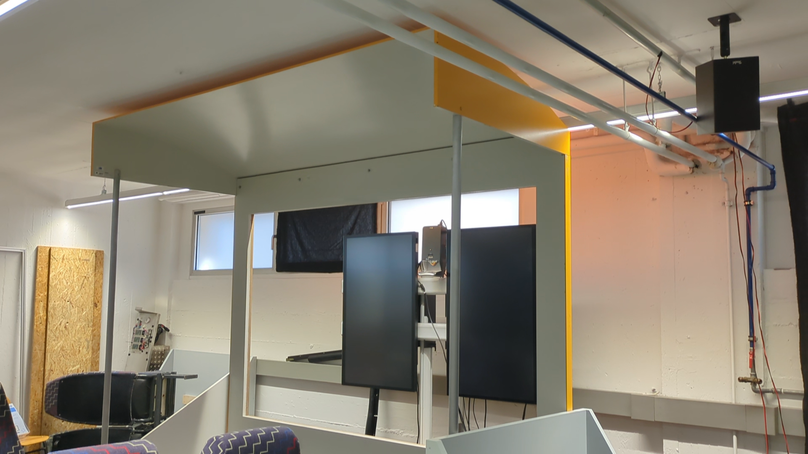

# 3DCV Workshop Results – Marit Zenker
During the workshop, we reconstructed small 3D objects and compared a range of tools and techniques used for 3D reconstruction. The results are presented in the following sections.

## Workflow

The following steps outline the workflow used in the workshop to create and visualize 3D reconstructions of small objects:
- Prepare input images
    - Capture images
    - If video: some tools might need images instead -> use [ffmpeg](https://ffmpeg.org/) to extract frames from the video
    - (Optionally) Mask object using [Segment Anything](https://segment-anything.com/)
- Reconstruct object using chosen tool
- Visualize reconstrcution results
    - Import all reconstructions into Blender for comparability
    - If point cloud: use Geometry Nodes to render the points with their correct colors
    - Import reconstructed camera poses into Blender from Colmap using [Blender Photogrammetry Importer](https://github.com/SBCV/Blender-Addon-Photogrammetry-Importer) for comparison with ground truth images
    - Render camera poses (using [this script](render.py))

## Compared Tools
The following tools were tested and compared:
<table>
    <thead>
        <tr>
            <th></th>
            <th>Tools</th>
            <th>Platforms</th>
            <th>Output</th>
            <th>Number of input images required</th>
            <th>Settings Used</th>
        </tr>
    </thead>
    <tbody>
        <tr>
            <td rowspan="3">Traditional Feature- Based</td>
            <td><a href="https://colmap.github.io/">Colmap</a> <small>2016</small></td>
            <td>Linux, macOS, Windows</td>
            <td>Sparse/Dense Point Cloud, Mesh (Poisson/Delaunay)</td>
            <td>Many</td>
            <td>Default Settings (+ same intrinsics for all images)</td>
        </tr>
        <tr>
            <td><a href="https://alicevision.org/#meshroom">Meshroom</a> <small>9 August 2018</small></td>
            <td>Linux, Windows</td>
            <td>Point Cloud, Mesh</td>
            <td>Many</td>
            <td>Default Settings</td>
        </tr>
        <tr>
            <td><a href="https://poly.cam/">Polycam</a> <small>2020</small></td>
            <td>iOS, Android, Web</td>
            <td>Mesh (Free Version), Point Cloud (Paid), 3DGS</td>
            <td>20-150, works better with more images</td>
            <td>Auto Mode, Full quality, isolate object from environment for dinosaur</td>
        </tr>
        <tr>
            <td rowspan="4">Model- Based</td>
            <td><a href="https://github.com/naver/dust3r">DUST3R</a> <small>21 Dec 2023</small></td>
            <td>Linux, macOS, Windows</td>
            <td>Point Cloud, Mesh</td>
            <td>Few sufficient (5-10), but might work better with more</td>
            <td>Model: DUST3R_ViTLarge_BaseDecoder_512_dpt min_conf_thr: 3, cam_size: 0.05, schedule: linear, num_iterations: 300, complete: all possible image pairs</td>
        </tr>
        <tr>
            <td><a href="https://github.com/naver/mast3r">MAST3R</a> <small>14 Jun 2024</small></td>
            <td>Linux, Windows</td>
            <td>Point Cloud, Mesh</td>
            <td>Few sufficient (5-10), but might work better with more</td>
            <td>Model: MASt3R_ViTLarge_BaseDecoder_512_catmlpdpt_metric, Default Settings</td>
        </tr>
        <tr>
            <td><a href="https://github.com/HengyiWang/spann3r">SPANN3R</a> <small>28 Aug 2024</small></td>
            <td>Linux, Windows</td>
            <td>Point Cloud</td>
            <td>Few sufficient (5-10), but might work better with more</td>
            <td>?</td>
        </tr>
        <tr>
            <td><a href="https://github.com/facebookresearch/vggt">VGGT</a> <small>14 Mar 2025</small></td>
            <td>Linux, Windows</td>
            <td>Point Cloud</td>
            <td>?</td>
            <td>?</td>
        </tr>
    </tbody>
</table>

The table compares traditional feature-based and model-based 3D reconstruction tools. Traditional methods such as COLMAP and Meshroom typically require large image sets for accurate reconstruction, while recent model-based approaches like DUST3R and MAST3R can produce plausible results from as few as 5–10 input images. However, performance generally improves with additional data.

The time taken for 3D reconstruction was not measured due to the constraints of the workshop, and direct comparison would be unreliable as the tools were tested on different systems.

Not all tools listed were tested by the author, therefore the table may be incomplete.

### MAST3R Installation
- CUDA 12.4 and Visual Studio 2022 required
- follow [installation instructions](https://github.com/naver/mast3r?tab=readme-ov-file#installation)
- set the ignore version check flag in setup.py

## Image Collection
Capturing high-quality images is crucial for successful 3D reconstruction. The following guidelines help ensure optimal results, whether using traditional Structure-from-Motion (SfM) pipelines or AI-based models:

- Keep the object stationary; move the camera around it to avoid inconsistent lighting
- Use diffuse, even lighting to prevent harsh shadows or highlights
- Ensure sufficient overlap between images for reliable feature matching
- Avoid blurry images (from motion or shallow depth-of-field), strong lighting effects, insufficient coverage, and poor overlap
- For SfM: more images generally improve results
- For AI models: fewer images may suffice, but computation time increases with more images

### Object properties
In previous tests (carried out outside of this workshop), we found that the reconstruction using SfM tools does not work well on objects with little to no textures and consequently few features like this Origami crane:

    

Both having a static camera and turning the object as well as moving the camera around the object did not work for reconstruction using Colmap, Meshroom, RealityCapture, and Polycam. Parts of the room were reconstructed, but not the crane. Therefore, we focused on objects with more textures and distinguishable features.

### Smartphone vs. Camera
We compared the results of 3D reconstructions using a smartphone camera (Google Pixel 9a) and a bridge camera (Nikon Coolpix P950). Despite the difference in sensor size and image resolution, the quality disparity between the two devices was negligible for most tools, especially AI-based models, since input images are typically downscaled during processing. While the bridge camera provides more manual control over image settings, the smartphone’s automatic mode or limited manual adjustments still produced images of sufficient quality for reconstruction.

The only notable issue with the smartphone camera was its shallow depth-of-field resulting in some parts of the image being blurry. In these areas less features were found during the reconstruction process, leading to those areas being reconstructed less accurately.

However overall, we found no significant differences in the final reconstruction quality between the two cameras.

### Background
We found that for most tools, the background behind the object does not really matter, as long as the object is clearly distinguishable from the background.\
In some cases, like with the Origami crane, it might even help: even if the object itself does not have many distinguishable features, placing it on top of a patterned surface lead to the reconstruction still being adequate.

We also found that traditional SfM methods also worked if the camera was static and instead the object was moved (see section V1: Dice on turntable). For AI models such as MAST3R, this is not the case. 

For Polycam, background removal is generally not critical since the object can often be isolated during processing; however, removing the background may still improve reconstruction quality, especially for challenging cases like the origami crane. For AI models such as MAST3R, background removal becomes essential if the object was rotated instead of the camera. Otherwise, features from the background may be incorrectly recognized, causing all camera poses to be estimated at nearly the same location in space. This results in theoretically correct camera positions, but they do not accurately relate to the object being reconstructed.

## Results

### Crochet Dinosaur
The first object tested was a crochet dinosaur: 

    

Images were taken using the Polycam Auto mode, the frames then exported and used for all other tools. All traditional feature-based methods as well as VGGT used 94 frames, while DUST3R, MAST3R, and SPANN3R used only every fourth frame, so 24 in total.
  
The results can be found in the following tables.
  

<strong>Comparison Table: Results</strong>

<table>
    <thead>
        <tr>
            <th>Tools</th>
            <th>Output</th>
            <th>Side</th>
            <th>Front</th>
            <th>45°</th>
            <th>No. of points</th>
        </tr>
    </thead>
    <tbody>
        <tr>
                <td rowspan="3">Colmap</td>
                <td>Fused Point Cloud (.ply)</td>
                <td></td>
                <td></td>
                <td></td>
                <td>530,664</td>
        </tr>
        <tr>
                <td>Poisson Mesh (.ply)</td>
                <td></td>
                <td></td>
                <td></td>
                <td>4,588</td>
        </tr>
        <tr>
                <td>Delaunay Mesh (.ply)</td>
                <td></td>
                <td></td>
                <td></td>
                <td>60,128</td>
        </tr>
            <tr>
                <td>Meshroom</td>
                <td>Mesh (.obj)</td>
                <td></td>
                <td></td>
                <td></td>
                <td>57,367</td>
        </tr>
        <tr>
                <td>Polycam</td>
                <td>Mesh (.glb)</td>
                <td></td>
                <td></td>
                <td></td>
                <td>10,629</td>
        </tr>
        <tr>
                <td rowspan="2">DUST3R</td>
                <td>Point Cloud (.glb)</td>
                <td></td>
                <td></td>
                <td></td>
                <td>2,091,526</td>
        </tr>
        <tr>
                <td>Mesh (.glb)</td>
                <td></td>
                <td></td>
                <td></td>
                <td>2,048,454</td>
        </tr>
        <tr>
                <td rowspan="2">MAST3R</td>
                <td>Point Cloud (.glb)</td>
                <td></td>
                <td></td>
                <td></td>
                <td>811,238</td>
        </tr>
        <tr>
                <td>Mesh (.glb)</td>
                <td></td>
                <td></td>
                <td></td>
                <td>776,014</td>
        </tr>
        <tr>
                <td rowspan="3">SPANN3R</td>
                <td>Confidence Threshold 0.01 Pointcloud (.ply)</td>
                <td></td>
                <td></td>
                <td></td>
                <td>13,714</td>
        </tr>
        <tr>
                <td>Confidence Threshold 0.001 Pointcloud (.ply)</td>
                <td></td>
                <td></td>
                <td></td>
                <td>51,623</td>
        </tr>
        <tr>
                <td>Confidence Threshold 0.0001 Pointcloud (.ply)</td>
                <td></td>
                <td></td>
                <td></td>
                <td>131,132</td>
        </tr>
        <tr>
                <td>VGGT</td>
                <td>Point Cloud (.glb)</td>
                <td></td>
                <td></td>
                <td></td>
                <td>1,090,554</td>
        </tr>
    </tbody>
</table>

 

</table>

<strong>Ground Truth vs. Rendered Results</strong>

<table>
    <tr>
        <td></td>
        <td>Ground Truth</td>
        <td>Rendered View</td>
        <td>Ground Truth</td>
        <td>Rendered View</td>
    <tr>
    <tr>
        <td>Colmap Fused</td>
        <td></td>
        <td></td>
        <td></td>
        <td></td>
    </tr>
    <tr>
        <td>Colmap Poisson</td>
        <td></td>
        <td></td>
        <td></td>
        <td></td>
    </tr>
    <tr>
        <td>Colmap Delaunay</td>
        <td></td>
        <td></td>
        <td></td>
        <td></td>
    </tr>
    <tr>
        <td>Meshroom</td>
        <td></td>
        <td></td>
        <td></td>
        <td></td>
    </tr>
    <tr>
        <td>Polycam</td>
        <td></td>
        <td></td>
        <td></td>
        <td></td>
    </tr>
    <tr>
        <td>DUST3R Point Cloud</td>
        <td></td>
        <td></td>
        <td></td>
        <td></td>
    </tr>
    <tr>
        <td>DUST3R Mesh</td>
        <td></td>
        <td></td>
        <td></td>
        <td></td>
    </tr>
    <tr>
        <td>MAST3R Point Cloud</td>
        <td></td>
        <td></td>
        <td></td>
        <td></td>
    </tr>
    <tr>
        <td>MAST3R Mesh</td>
        <td></td>
        <td></td>
        <td></td>
        <td></td>
    </tr>
    <tr>
        <td>SPANN3R confidence_threshold 0.01</td>
        <td></td>
        <td></td>
        <td></td>
        <td></td>
    </tr>
    <tr>
        <td>SPANN3R confidence_threshold 0.001</td>
        <td></td>
        <td></td>
        <td></td>
        <td></td>
    </tr>
    <tr>
        <td>SPANN3R confidence_threshold 0.0001</td>
        <td></td>
        <td></td>
        <td></td>
        <td></td>
    </tr>
    <tr>
        <td>VGGT</td>
        <td></td>
        <td></td>
        <td></td>
        <td></td>
    </tr>
</table>
This table presents two ground truth images alongside the corresponding renderings from their respective models, all from the same intended camera viewpoint. Camera poses were estimated using COLMAP, and the models were manually aligned, so the rendered viewpoints may not perfectly match the ground truth.

As shown in the tables, these are the results for each tool:
- Colmap:
    - Dense point cloud seems quite accurate, parts of background reconstructed as well
    - Poisson Mesh Reconstruction did not produce any sensible results
    - Delaunay Mesh Reconstruction accurately captures the objects geometry, but struggles with the background and does not produce any color
- Polycam: Best results with accurate geometry and colors
- Meshroom: Produces an accurate mesh <em>(Note: Color data was created but not exported in this particular instance.)</em>
- DUST3R: Both the point cloud and the mesh are recognizable, but there are some artifacts in the geometry
- MAST3R: Better reconstruction than DUST3R, but still some artifacts
- SPANN3R: Better results for smaller confidence thresholds, but a lot of misplaced geometry and worse results than DUST3R and MAST3R
- VGGT: Many misplaced points, object hard to recognize

In general, traditional feature-based tools reconstructed the geometry more accurately, but they also used more input images.

The crochet pattern was reconstructed relatively well by all tools (at least in parts of the object) demonstrating general robustness to texture. However, all methods struggled with the reflective eyes of the dinosaur, suggesting that specular or non-Lambertian surfaces remain a challenge. To explore this further, we also conducted experiments using reflective dice.

### Dice Set
In this section, we will look at the results of three different experiments with reflective dice. The goal was to test how well different tools can reconstruct objects with view-dependent properties, such as the reflective sides of the dice. Since all tested tools already struggled with the eyes of the crochet dinosaur, we did not expect the results to be good, but we wanted to see how well the different tools handle these objects and how to improve results.

For this, we evaluated three different test setups described in the following sections.

<em>Note: the dive were placed differently for each test setup, so the results cannot be compared directly.</em>

#### V1: Dice on turntable
In this experiment, dice were placed on a turntable and a video taken using Polycam and a static phone camera. Since the lighting on the dice is different in each frame, we did not expect this to produce any reasonable results. As seen in the images below, the side with the number 20 on the right die is clearly visible in the first image, but this side appears completely white just two frames after that.\
Colors also appear differently depending on the angle of the lighting - for example, in frame 7, the 4-sided die at the bottom of the image appears much brighter than the other dice because of the way the light hits it, even though all dice are the same color.

Input images:
<table>
    <tr>
        <td></td>
        <td></td>
        <td></td>
        <td></td>
    </tr>
    <tr>
        <td>Frame 1</td>
        <td>Frame 3</td>
        <td>Frame 5</td>
        <td>Frame 7</td>
    </tr>
</table>

48 images were captured using Polycam, which does not allow for camera control, which is why the images are slightly overexposed.\
Despite these issues, the reconstruction using Polycam was surprisingly good, as seen in the images below. The mesh is not perfect, but the dice are clearly recognizable and the numbers on them are visible. The changing lighting conditions lead to the mesh having multiple colors, which is not realistic, but looks interesting and might be useful for some creative applications.

Frames rendered from the Polycam reconstruction:
<table>
    <tr>
        <td></td>
        <td></td>
        <td></td>
    </tr>
</table>

#### V2: Dice in more diffuse light, circled by camera
In this version, the dice were placed on a static table and the camera was moved around them, capturing 156 images from different angles using Polycam again. The lighting was kept consistent to avoid the issues seen in the first version. Also, since the camera did not have to be fixed, we captured images from different heights and not just the same level. The images below show the dice from different angles, with the numbers clearly visible.\
In addition to the camera moving instead of the dice, the lighting was also more diffuse, which means that the dice reflect the light more evenly. This leads to a more consistent appearance of the dice in the images, as seen in the first three images below. Still, the fourth image shows that the dice still reflect the light differently depending on the camera angle. Again, the 4-sided die appears brighter. However, this issue is not as pronounced as in the first version, since the camera was moved around the object and not the other way around.

Input images:
<table>
    <tr>
        <td></td>
        <td></td>
        <td></td>
        <td></td>
    </tr>
</table>

Frames rendered from the Polycam reconstruction:
<table>
    <tr>
        <td></td>
        <td></td>
        <td></td>
    </tr>
</table>

This version produced a slightly more accurate mesh with crisper and more realistic textures (especially the numbers on the dice are much clearer). Due to the lighting conditions, the dice appear much darker and more uniformly colored than in v1.

#### V3: Dice placed on non-reflective surface, circled by camera
With this last test, we wanted to test if we could combine the more crisp results of v2 with the visually more interesting results of v1. To do this, we placed the dice in the same spot as v1 with a more direct light from one side on a non-reflective surface and moved the camera around them again. This time, we captured 48 images using the phone camera directly and not via Polycam. The images below show the dice from different angles, with the numbers clearly visible.\
Just in v1, the lighting on the sides of the dice is very different between frames.
Also, in frames where the camera was close to ground height, not all dice are in focus due to the shallow depth-of-field of the smartphone camera. This leads to some parts of the dice being blurry, which can be seen in the fourth image below.

Input images:
<table>
    <tr>
        <td></td>
        <td></td>
        <td></td>
        <td></td>
    </tr>
</table>

Since the results using Polycam were much better than the previous versions, we also tried some other models as seen in the tables below: 

<strong>Comparison Table: Results</strong>

<table>
    <thead>
        <tr>
            <th>Tools</th>
            <th>Output</th>
            <th>Top</th>
            <th>Floor</th>
            <th>Detail</th>
            <th>No. of points</th>
        </tr>
    </thead>
    <tbody>
    <tr>
        <td rowspan="3">Colmap</td>
        <td>Fused Point Cloud (.ply)</td>
        <td></td>
        <td></td>
        <td></td>
        <td>734,263</td>
    </tr>
    <tr>
        <td>Poisson Mesh (.ply)</td>
        <td></td>
        <td></td>
        <td></td>
        <td>1,750,181</td>
    </tr>
    <tr>
        <td>Delaunay Mesh (.ply)</td>
        <td></td>
        <td></td>
        <td></td>
        <td>99,790</td>
    </tr>
    <tr>
        <td>Meshroom</td>
        <td>Mesh (.obj)</td>
        <td></td>
        <td></td>
        <td></td>
        <td>622,216</td>
    </tr>
    <tr>
        <td>Polycam</td>
        <td>Mesh (.glb)</td>
        <td></td>
        <td></td>
        <td></td>
        <td>243,604</td>
    </tr>
    <tr>
        <td rowspan="2">MAST3R</td>
        <td>Point Cloud (.glb)</td>
        <td></td>
        <td></td>
        <td></td>
        <td>1,185,140</td>
    </tr>
    <tr>
        <td>Mesh (.glb)</td>
        <td></td>
        <td></td>
        <td></td>
        <td>1,120,949</td>
    </tr>
    </tbody>
</table>

 

<strong>Ground Truth vs. Rendered Results</strong>

<table>
    <tr>
        <td></td>
        <td>Ground Truth</td>
        <td>Rendered View</td>
        <td>Ground Truth</td>
        <td>Rendered View</td>
    <tr>
        <td>Colmap Fused</td>
        <td></td>
        <td></td>
        <td></td>
        <td></td>
    </tr>
    <tr>
        <td>Colmap Poisson</td>
        <td></td>
        <td></td>
        <td></td>
        <td></td>
    </tr>
    <tr>
        <td>Colmap Delaunay</td>
        <td></td>
        <td></td>
        <td></td>
        <td></td>
    </tr>
    <tr>
        <td>Meshroom</td>
        <td></td>
        <td></td>
        <td></td>
        <td></td>
    </tr>
    <tr>
        <td>Polycam</td>
        <td></td>
        <td></td>
        <td></td>
        <td></td>
    </tr>
    <tr>
        <td>MAST3R Point Cloud</td>
        <td></td>
        <td></td>
        <td></td>
        <td></td>
    </tr>
    <tr>
        <td>MAST3R Mesh</td>
        <td></td>
        <td></td>
        <td></td>
        <td></td>
    </tr>
</table>
This table presents two ground truth images alongside the corresponding renderings from their respective models, all from the same intended camera viewpoint. Camera poses were estimated using COLMAP, and the models were manually aligned, so the rendered viewpoints may not perfectly match the ground truth.

<em>Note: Due to time constraints we could not test all tools mentioned above on this dataset.</em>

 

These are the observed results for each tested tool:
- Colmap:
    - The point cloud is generally accurate, but some areas are missing, probably where there where dark shadows around the dice
    - Poisson Mesh Reconstruction has the same missing areas, but otherwise looks to be quite accurate
    - Delaunay Mesh Reconstruction seems to be less accurate than Poisson and has no textures, but does not have the same missing areas
- Polycam: Again, Polycam produces the best results with accurate geometry and textures
- Meshroom: The geometry and textures are reconstructed quite accurately, but there are some white spots
- MAST3R: The geometry is less accurate than the ones of other tools, the textures on the dice are blurry and the background is very patchy <em>(Note: MAST3R generated the model using only 12 images)</em>

The results were better than expected. Although view-dependent effects are baked into the model, the scene was still reconstructed with reasonable accuracy. These effects result in visually interesting artifacts, which may be desirable in certain use cases or artistic applications.

### Scene (tram replica)
For this scene, we once again used Polycam to capture frames of a test tram scene. The scene is loosely based on a tram and was constructed as a simplified replica. An impression of the setup can be seen below <em>(Note: this is not the exact configuration used during image capture)</em>:

However, Polycam's reconstruction quality was poor: Some areas are severely distorted or missing completely, windows are partially filled in with a mix of reflected scene elements and the background room, while their central parts are missing altogether.

Interestingly, while the geometry is highly inaccurate, the textures on the existing geometry are relatively well-preserved. Examples of the reconstruction are shown below:
<table>
    <tr>
        <td></td>
        <td></td>
    </tr>
</table>

The poor reconstruction quality is likely due to the characteristics of the scene. Strong directional light sources directly above and behind the scene introduced significant highlights and glare in the captured images. In addition, numerous reflective surfaces such as windows and screens reflected both the light and the surrounding environment, depending on the camera angle. Thin structures, like the poles holding up the roof, and relatively large textureless surfaces further complicated the reconstruction process.

<table>
  <tr>
    <td style="width: 300px; height: 150px; vertical-align: top;">
       
      Reflective surfaces (mainly the roof and monitor), light from behind
    </td>
    <td style="width: 300px; height: 150px; vertical-align: top;">
       
      Windows that partly reflect the scene in front while also showing the room behind
    </td>
    <td style="width: 300px; height: 150px; vertical-align: top;">
       
      Thin poles
    </td>
  </tr>
</table>

Due to time constraints, we were unable to re-capture the scene or experiment with different scenes or the other reconstruction tools mentioned earlier.

## Findings

### Traditional Tools 
Overall, traditional feature-based reconstruction tools delivered solid results. Colmap produced accurate point clouds, but struggled with mesh quality and requires some getting used to due to its more complex interface. It also took the longest time to produce a dence point cloud and mesh.\
Polycam consistently delivered the best results for small objects with minimal user effort and an intuitive interface.\
Meshroom performed well but required background removal in some cases.

### AI Models
The AI-based tools varied in quality and performance. DUST3R performed relatively well and reconstructed not only the object but a significant portion of the background. Since it was not using the correct GPU it took significantly longer than the other AI-based tools.\
MAST3R produced the most accurate and complete reconstructions among the AI tools but required either a camera orbiting the object or a completely uniform background with no features. While it struggled with generating clean meshes, it still outperformed the others in overall detail.\
SPANN3R produced better results the lower the confidence threshold, but produced disfigured and unreliable geometry.\
VGGT showed limited performance, producing many floating artifacts, inaccurate geometry and colors only in some places.

Still, all AI models but VGGT were tested using only a quarter of the test images compared to the traditional tools. Using the same number of input images might lead to results on par or better than traditional methods.\
In our experiments, AI tools were also faster, but this might not be true when using the same number of input images. Additionally, they require more hardware resources, particularly NVIDIA GPUs, making them less accessible.

### Limitations in specific use cases
Certain limitations emerged across both traditional and AI-based methods. 
Both variations struggled with non-lambertian effects, but traditional tools performed a bit more robustly in that regard. They also produced better and more consistent results in terms of geometry, but also require more input images.

### Real-time Capabilities
None of the tools tested are capable of real-time 3D reconstruction. AI methods can produce results more quickly since they are capable of generating a reasonable reconstruction with much fewer input images, but achieving high-quality reconstructions still requires considerable processing time for both traditional and AI-based approaches.

## Conclusion
This project compared traditional and AI-based tools for 3D object reconstruction, highlighting their strengths, limitations, and practical trade-offs. Traditional methods such as COLMAP and Meshroom generally produced more accurate and consistent geometry, especially when provided with many input images. However, they are slower, more complex to use, and require substantial data capture. In contrast, recent AI-based tools like DUST3R and MAST3R were able to generate plausible reconstructions from as few as 5–10 images, although the results were often patchy or less detailed.\
These reconstructions might be sufficient for further processing like the creation of NeRFs or 3D Gaussian Splatting scenes. However, these methods still require many input images, so it is questionable if they currently provide an advantage in this context over traditional feature-based methods like Colmap.

Both approaches struggled with non-Lambertian surfaces, such as reflections or transparency, and none of the tested tools supported real-time reconstruction. While AI methods can be faster in some cases due to their ability to infer geometry from limited data, high-quality outputs from both categories still require processing time and good input conditions.

As AI models become more robust and efficient, they might be able to produce high-quality outputs from few input images with fast processing time, providing a great advantage over traditional methods. This would make 3D reconstructions more accessible and applicable across fields such as AR/VR, robotics, and digital content creation.

