# 3DCV Workshop Results – Marit Zenker

## Workflow

The following steps outline the workflow used in the workshop to create and visualize 3D reconstructions of small objects:
- Prepare input images
    - Capture images
    - If video: some tools might need images instead -> use [ffmpeg](https://ffmpeg.org/) to extract frames from the video
    - (Optionally) Mask object
- Reconstruct object
- Visualize
    - Import into Blender
    - If pointcloud: use Geometry Nodes to render
    - Import camera poses into Blender from Colmap using [Blender Photogrammetry Importer](https://github.com/SBCV/Blender-Addon-Photogrammetry-Importer)

## Image Collection
Capturing high-quality images is crucial for successful 3D reconstruction. The following guidelines help ensure optimal results, whether using traditional Structure-from-Motion (SfM) pipelines or AI-based models:

- Keep the object stationary; move the camera around it to avoid inconsistent lighting
- Use diffuse, even lighting to prevent harsh shadows or highlights
- Ensure sufficient overlap between images for reliable feature matching
- Avoid blurry images (from motion or shallow depth-of-field), strong lighting effects, insufficient coverage, and poor overlap
- For SfM: more images generally improve results
- For AI models: fewer images may suffice, but computation time increases with more images

### Object properties
In previous tests (carried out outside of this workshop), we found that the reconstruction using SfM tools does not work well on objects with little to no textures and consequently few features like this Origami crane:

    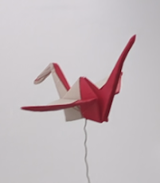

Both having a static camera and turning the object as well as moving the camera around the object did not work for reconstruction using Colmap, Meshroom, RealityCapture, and Polycam. Parts of the room were reconstructed, but not the crane. Therefore, we focused on more textured objects, mainly a crochet dinosaur:

    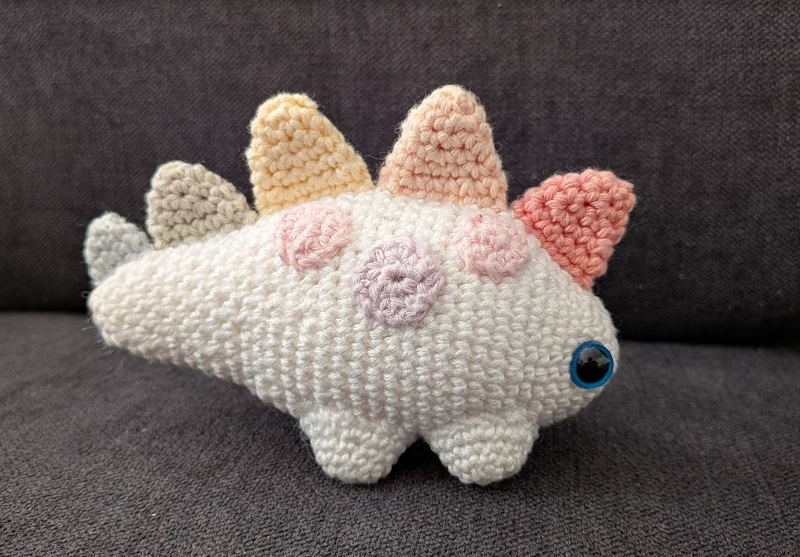

### Smartphone vs. Camera
We compared the results of 3D reconstructions using a smartphone camera (Google Pixel 9a) and a bridge camera (Nikon Coolpix P950). Despite the difference in sensor size and image resolution, the quality disparity between the two devices was negligible for most tools, especially AI-based models, since input images are typically downscaled during processing. While the bridge camera provides more manual control over image settings, the smartphone’s automatic mode or limited manual adjustments still produced images of sufficient quality for reconstruction.

The only notable issue with the smartphone camera was its shallow depth-of-field resulting in some parts of the image being blurry. In these areas less features were found during the reconstruction process, leading to those areas being reconstructed less accurately.

However overall, we found no significant differences in the final reconstruction quality between the two cameras.

### Background
We found that for most tools, the background behind the object does not really matter, as long as the object is clearly distinguishable from the background.\
In some cases, like with the Origami crane, it might even help: even if the object itself does not have many distinguishable features, placing it on top of a patterned surface lead to the reconstruction still being adequate.

We also found that traditional SfM methods also worked if the camera was static and instead the object was moved (see section V1: Dice on turntable). For AI models such as MAST3R, this is not the case. 

For Polycam, background removal is generally not critical since the object can often be isolated during processing; however, removing the background may still improve reconstruction quality, especially for challenging cases like the origami crane. For AI models such as MAST3R, background removal becomes essential if the object was rotated instead of the camera. Otherwise, features from the background may be incorrectly recognized, causing all camera poses to be estimated at nearly the same location in space. This results in theoretically correct camera positions, but they do not accurately relate to the object being reconstructed.

## Comparison of different tools

<strong>Comparison Table: 3D Reconstruction Tools</strong>

<table>
    <thead>
        <tr>
            <th>Tools</th>
            <th>Output</th>
            <th>side</th>
            <th>front</th>
            <th>45°</th>
            <th>No. of points</th>
        </tr>
    </thead>
    <tbody>
        <tr>
                <td rowspan="3">Colmap <small>2016</small></td>
                <td>Fused Point Cloud (.ply)</td>
                <td></td>
                <td></td>
                <td>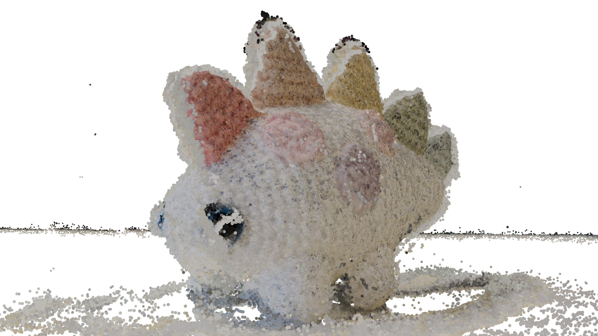</td>
                <td>530,664</td>
        </tr>
        <tr>
                <td>Poisson Mesh (.ply)</td>
                <td></td>
                <td></td>
                <td>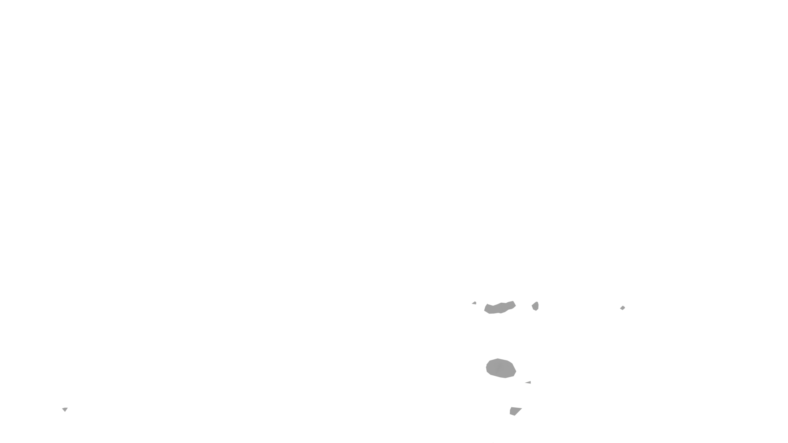</td>
                <td>4,588</td>
        </tr>
        <tr>
                <td>Delaunay Mesh (.ply)</td>
                <td></td>
                <td></td>
                <td></td>
                <td>60,128</td>
        </tr>
        <tr>
                <td>Polycam <small>2020</small></td>
                <td>Mesh (.glb)</td>
                <td>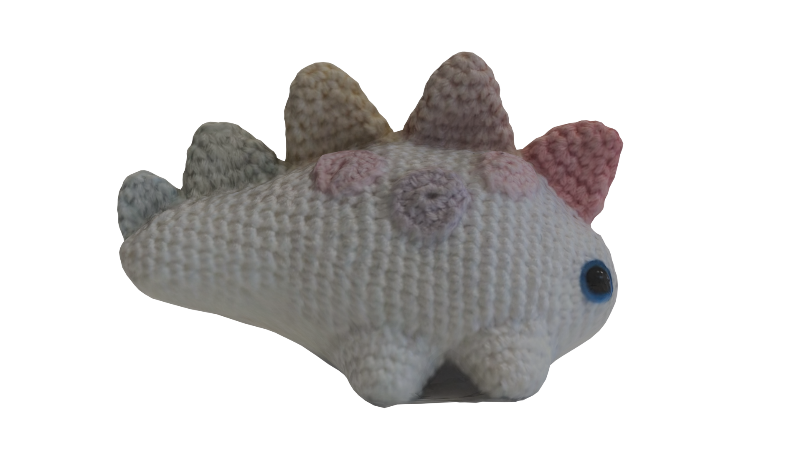</td>
                <td>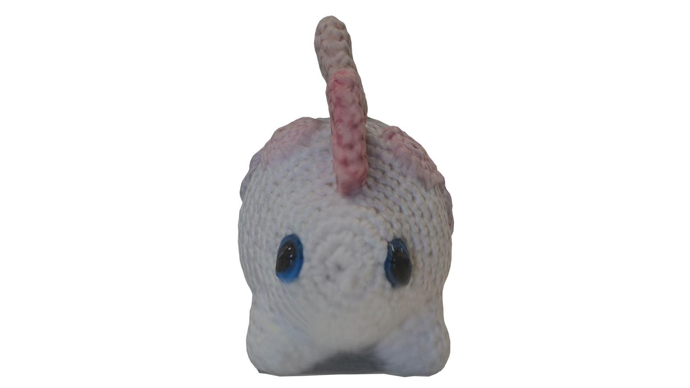</td>
                <td></td>
                <td>10,629</td>
        </tr>
        <tr>
                <td>Meshroom <small>9 August 2018</small></td>
                <td>Mesh (.obj)</td>
                <td></td>
                <td>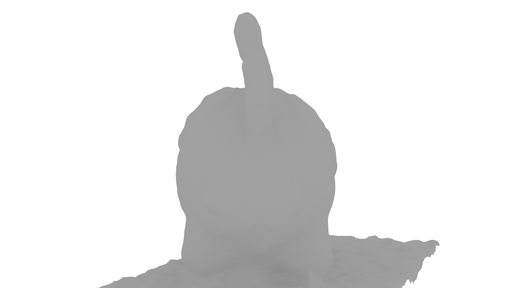</td>
                <td></td>
                <td>57,367</td>
        </tr>
        <tr>
                <td rowspan="2">Dust3r <small>21 Dec 2023</small></td>
                <td>Point Cloud (.glb)</td>
                <td></td>
                <td></td>
                <td></td>
                <td>2,091,526</td>
        </tr>
        <tr>
                <td>Mesh (.glb)</td>
                <td></td>
                <td>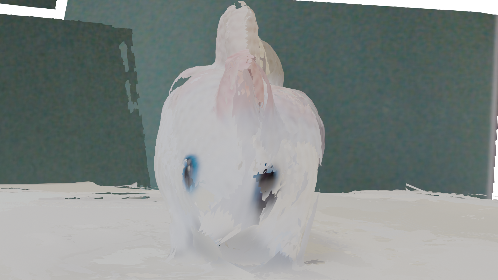</td>
                <td></td>
                <td>2,048,454</td>
        </tr>
        <tr>
                <td rowspan="2">Mast3r <small>14 Jun 2024</small></td>
                <td>Point Cloud (.glb)</td>
                <td></td>
                <td></td>
                <td>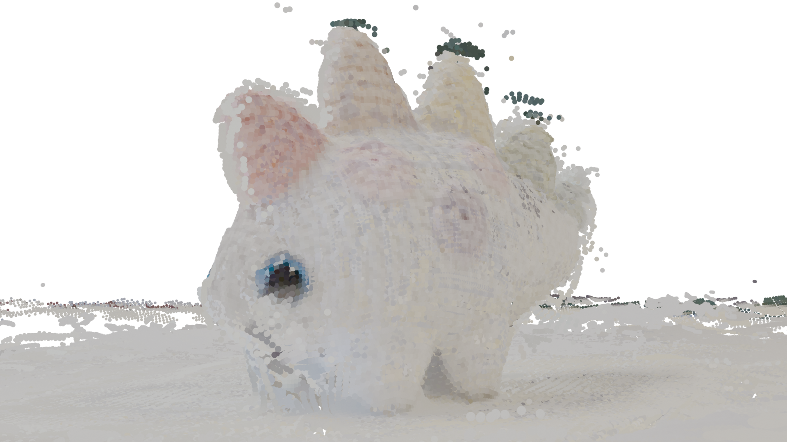</td>
                <td>811,238</td>
        </tr>
        <tr>
                <td>Mesh (.glb)</td>
                <td>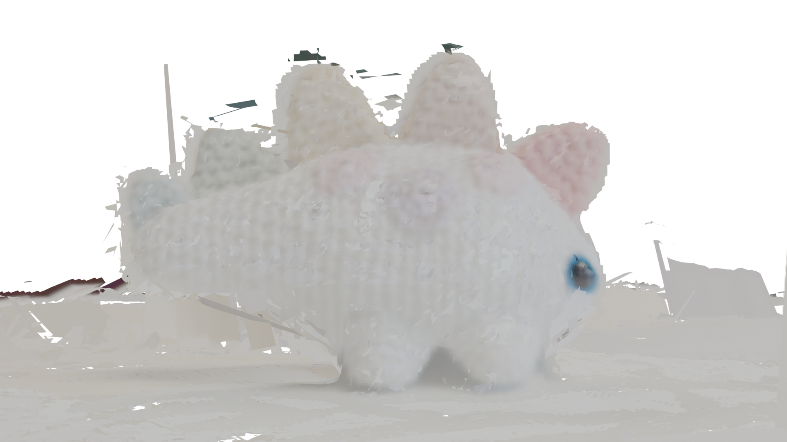</td>
                <td>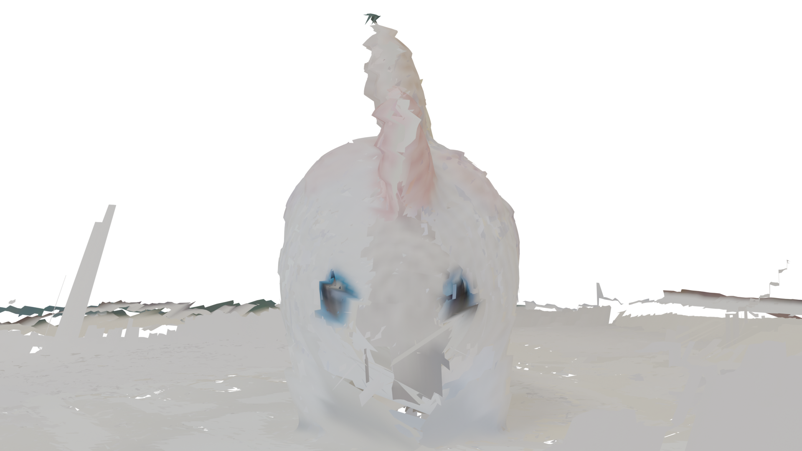</td>
                <td></td>
                <td>776,014</td>
        </tr>
        <tr>
                <td rowspan="3">Spann3r <small>28 Aug 2024</small></td>
                <td>Confidence Threshold 0.01 Pointcloud (.ply)</td>
                <td></td>
                <td>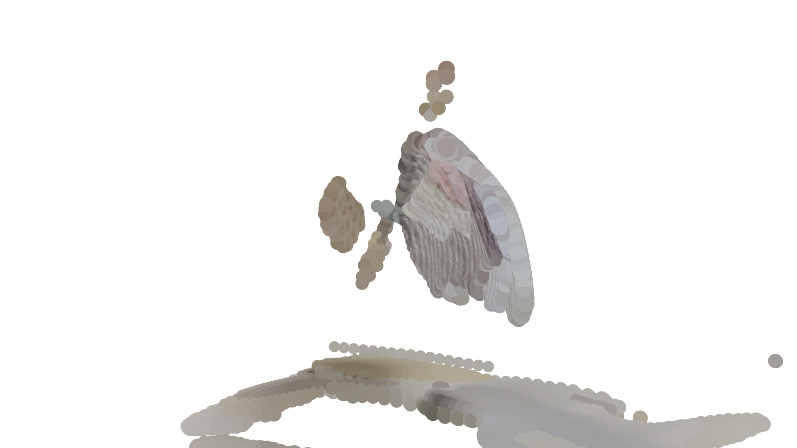</td>
                <td>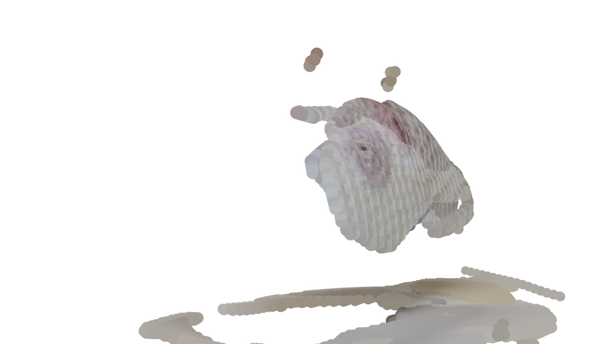</td>
                <td>13,714</td>
        </tr>
        <tr>
                <td>Confidence Threshold 0.001 Pointcloud (.ply)</td>
                <td></td>
                <td></td>
                <td>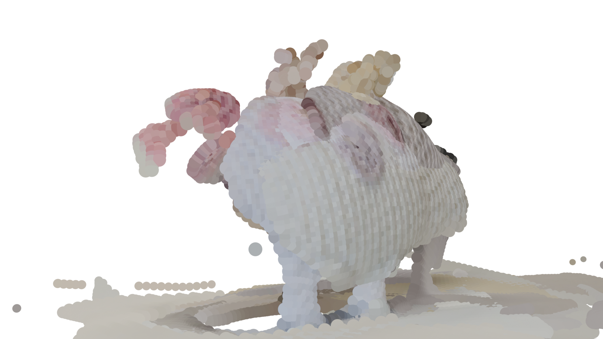</td>
                <td>51,623</td>
        </tr>
        <tr>
                <td>Confidence Threshold 0.0001 Pointcloud (.ply)</td>
                <td></td>
                <td></td>
                <td></td>
                <td>131,132</td>
        </tr>
        <tr>
                <td>VGGT <small>14 Mar 2025</small></td>
                <td>Point Cloud (.glb)</td>
                <td>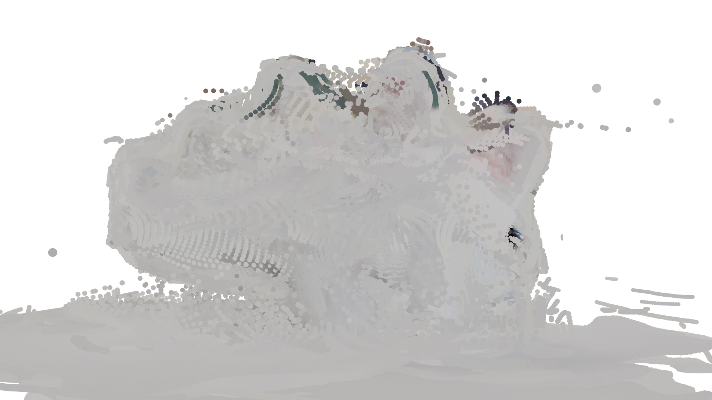</td>
                <td>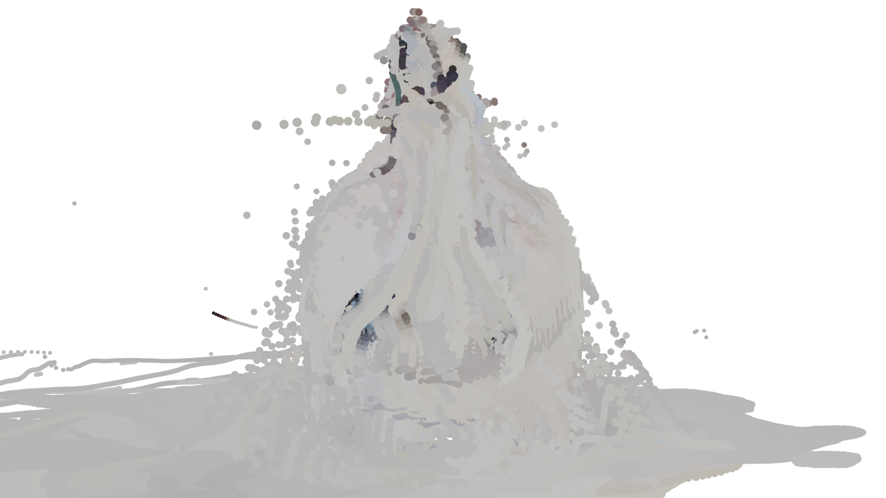</td>
                <td></td>
                <td>1,090,554</td>
        </tr>
    </tbody>
</table>

</table>

<strong>Ground Truth vs. Rendered Results (camera poses from Colmap)</strong>

<table>
    <tr>
        <td></td>
        <td>Ground Truth</td>
        <td></td>
        <td>Ground Truth</td>
        <td></td>
    <tr>
    <tr>
        <td>Colmap Fused</td>
        <td>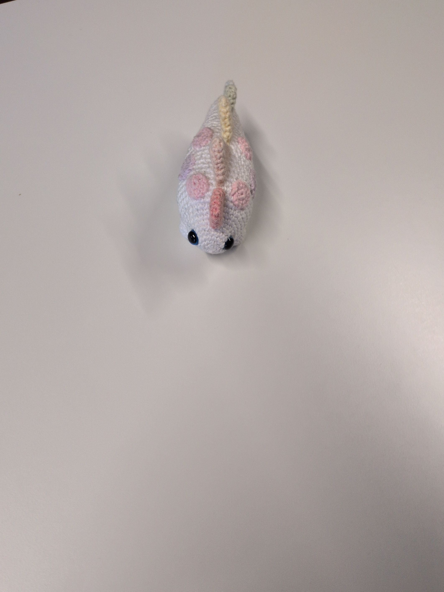</td>
        <td>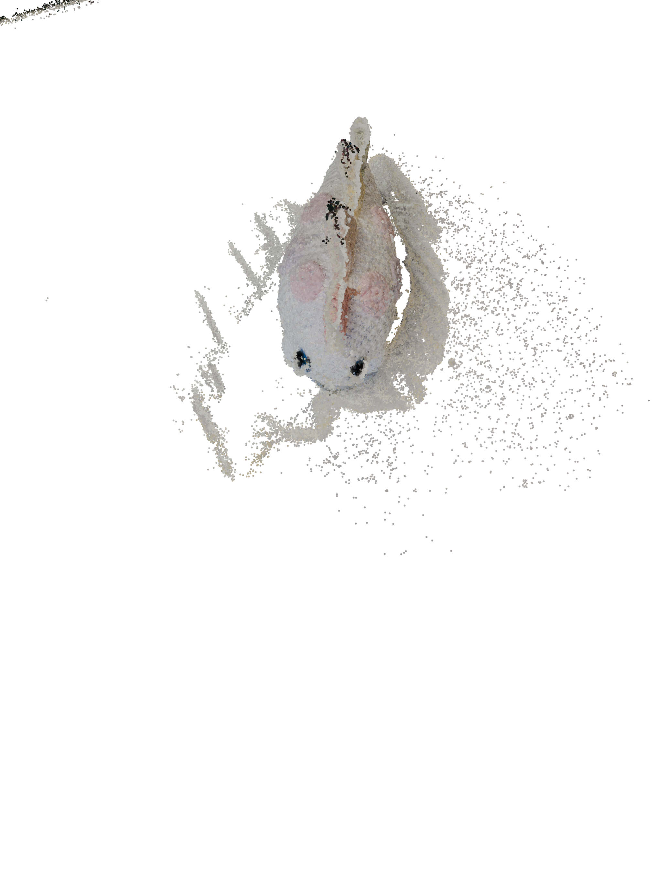</td>
        <td>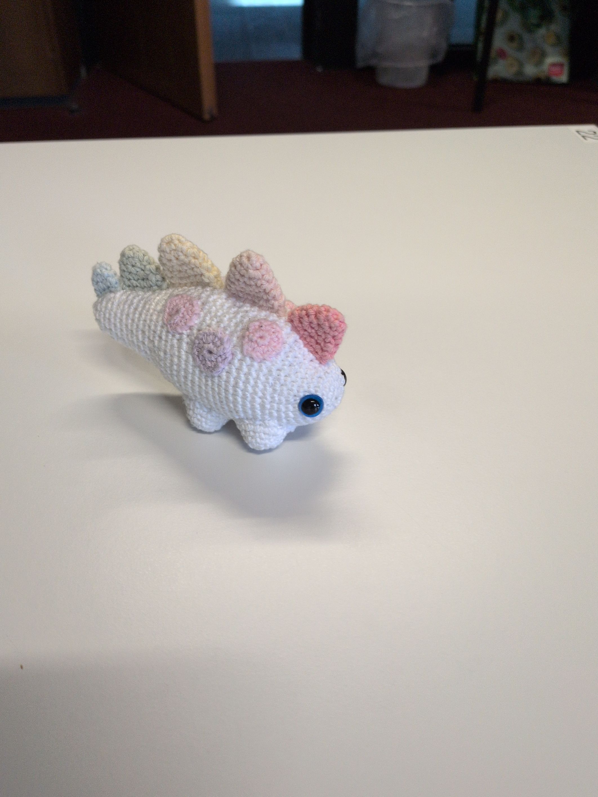</td>
        <td></td>
    </tr>
</table>

TODO: add dino input images
if nothing else mentioned: default settings
94 images used captured using automatic mode of Polycam, then images exported and used for other tools
DUST3R, MAST3R, SPANN3R: only used every fourth image, so 24 images in total
TOOD: reference eyes -> dice

## MAST3R Installation
- follow instructions
- CUDA 12.4 and Visual Studio 2022 required
- set the ignore version check flag in setup.py

SPANN3R: struggled with side of dino in shade, especially with high confidence threshold

## Tests with reflective objects
In this section, we will look at the results of three different experiments with reflective dice. The goal was to test how well different tools can reconstruct objects with view-dependent properties, such as the numbers on the sides of the dice. Due to the nature of SfM (TODO: source, mention NeRF & 3DGS), we did not expect the results to be good, but we wanted to see how well the different tools handle these objects and how to improve results.

TODO: dice placed differently between versions

### V1: Dice on turntable
48 images
In this experiment, dice were placed on a turntable and a video taken using Polycam and a static phone camera. Since the lighting on the dice is different in each frame, we did not expect this to produce any reasonable results. As seen in the images below, the side with the number 20 on the right die is clearly visible in the first image, but this side appears completely white just two frames after that.\
Colors also appear differently depending on the angle of the lighting - for example, in frame 7, the 4-sided die at the bottom of the image appears much brighter than the other dice because of the way the light hits it, even though all dice are the same color.
<table>
    <tr>
        <td></td>
        <td>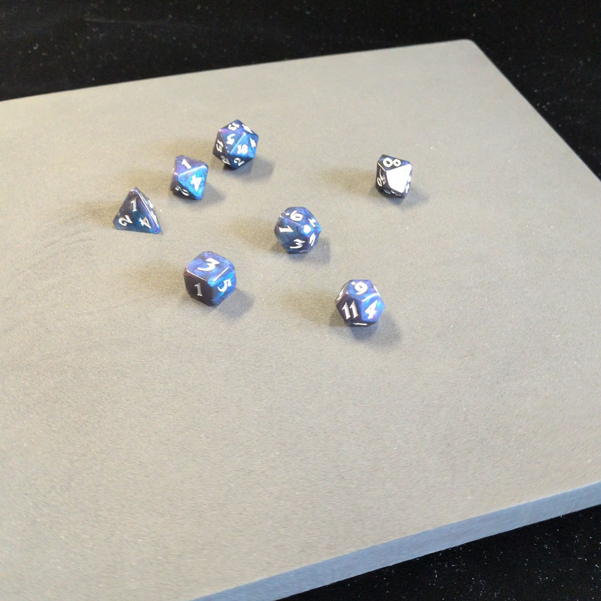</td>
        <td></td>
        <td>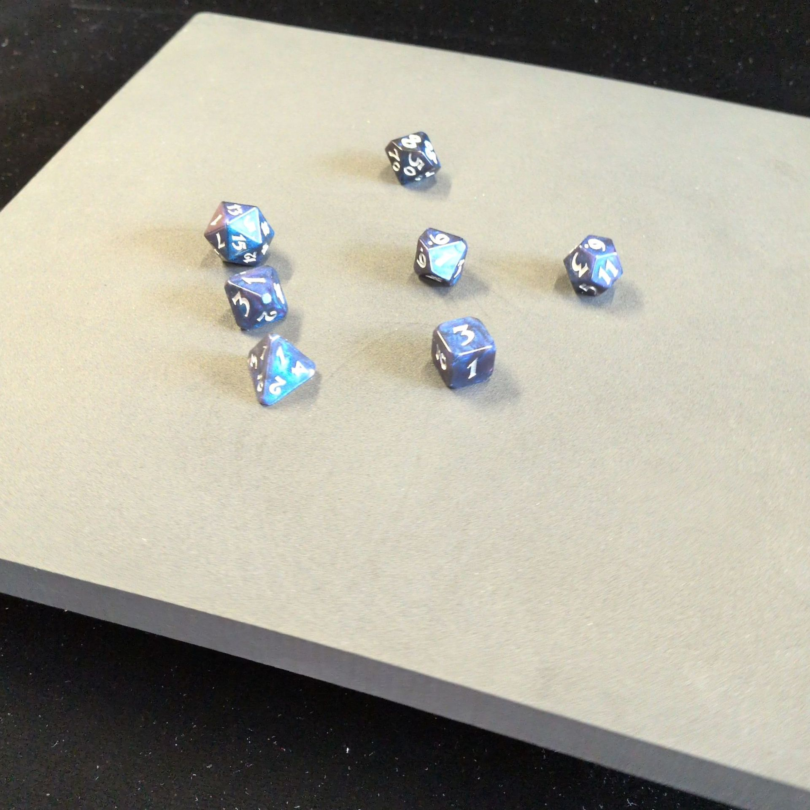</td>
    </tr>
    <tr>
        <td>Frame 1</td>
        <td>Frame 3</td>
        <td>Frame 5</td>
        <td>Frame 7</td>
    </tr>
</table>

These images were captured using Polycam, which does not allow for camera control, which is why the images are slightly overexposed.\
Despite these issues, the reconstruction using Polycam was surprisingly good, as seen in the images below. The mesh is not perfect, but the dice are clearly recognizable and the numbers on them are visible. The changing lighting conditions lead to the mesh having multiple colors, which is not realistic, but looks interesting and might be useful for some applications.

<table>
    <tr>
        <td></td>
        <td></td>
        <td></td>
    </tr>
</table>

### V2: Dice in more diffuse light, circled by camera
156 images
In this version, the dice were placed on a static table and the camera was moved around them, capturing images from different angles. The lighting was kept consistent to avoid the issues seen in the first version. Also, since the camera did not have to be fixed, we captured images from different heights and not just the same level. The images below show the dice from different angles, with the numbers clearly visible.\
In addition to the camera moving instead of the dice, the lighting was also more diffuse, which means that the dice reflect the light more evenly. This leads to a more consistent appearance of the dice in the images, as seen in the first three images below. Still, the fourth image shows that the dice still reflect the light differently depending on the camera angle. Again, the 4-sided die appears brighter. However, this issue is not as pronounced as in the first version, since the camera was moved around the object and not the other way around.
<table>
    <tr>
        <td>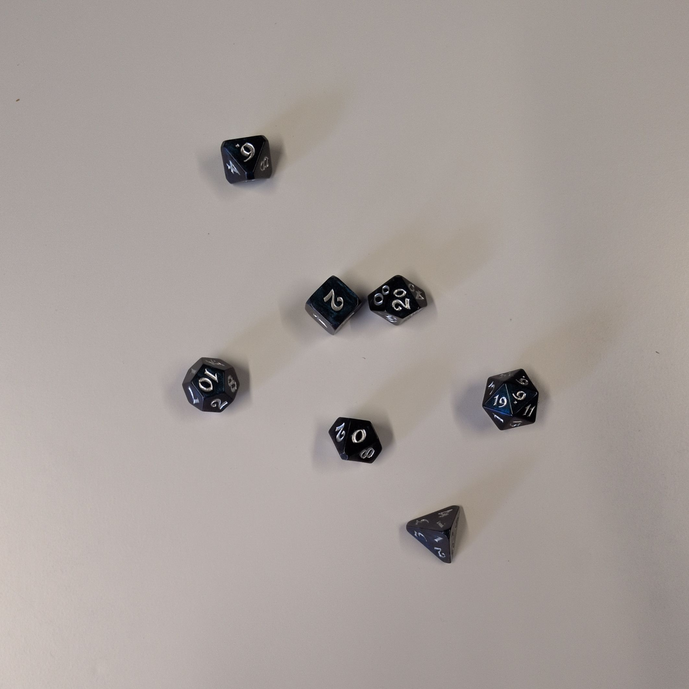</td>
        <td></td>
        <td>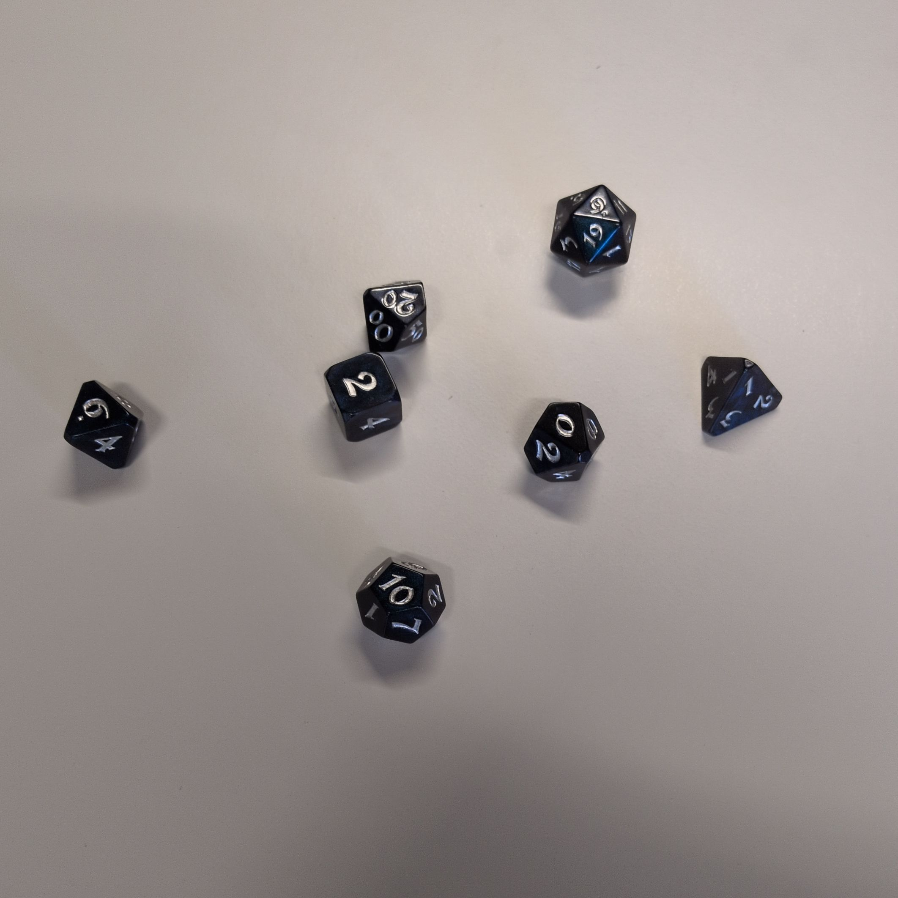</td>
        <td>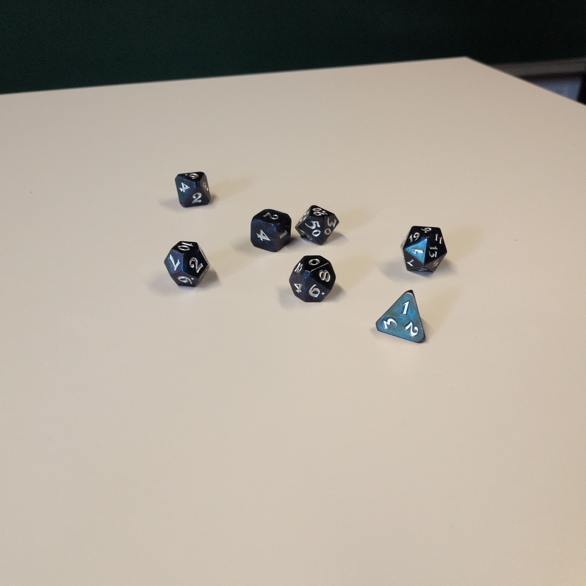</td>
    </tr>
</table>

<table>
    <tr>
        <td></td>
        <td></td>
        <td></td>
    </tr>
</table>

### V3: Dice placed on non-reflective surface, circled by camera
48 images, not taken with Polycam
With this last test, we wanted to test if we could combine the more crisp results of v2 with the visually more interesting results of v1. To do this, we placed the dice in the same spot as v1 with a more direct light from one side on a non-reflective surface and moved the camera around them again. The images below show the dice from different angles, with the numbers clearly visible.\
Just in v1, the lighting on the sides of the dice is very different between frames.
Also, in frames where the camera was close to ground height, not all dice are in focus due to the shallow depth-of-field of the smartphone camera. This leads to some parts of the dice being blurry, which can be seen in the fourth image below.

<table>
    <tr>
        <td></td>
        <td></td>
        <td>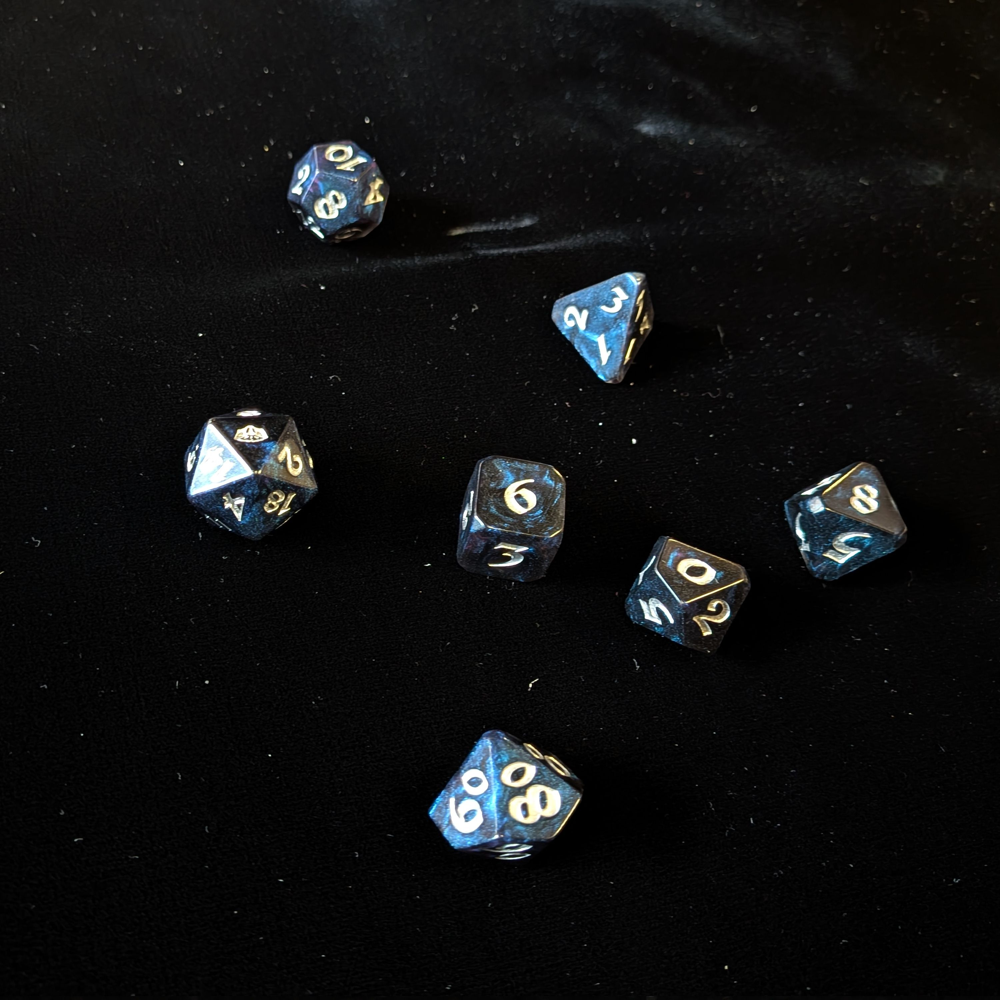</td>
        <td></td>
    </tr>
</table>

<strong>Results Table: Dice Reconstruction Comparison</strong>

<table>
    <tr>
        <td>Colmap Fused</td>
        <td></td>
        <td></td>
        <td></td>
    </tr>
    <tr>
        <td>Colmap Poisson</td>
        <td></td>
        <td></td>
        <td></td>
    </tr>
    <tr>
        <td>Colmap Delaunay</td>
        <td></td>
        <td></td>
        <td></td>
    </tr>
    <tr>
        <td>Polycam</td>
        <td></td>
        <td></td>
        <td></td>
    </tr>
    <tr>
        <td>Meshroom</td>
        <td></td>
        <td></td>
        <td></td>
    </tr>
    <tr>
        <td>MAST3R Point Cloud</td>
        <td></td>
        <td></td>
        <td></td>
    </tr>
    <tr>
        <td>MAST3R Mesh</td>
        <td></td>
        <td></td>
        <td></td>
    </tr>
</table>

<strong>Ground Truth vs. Rendered Results (camera poses from Colmap)</strong>

<table>
    <tr>
        <td></td>
        <td>Ground Truth</td>
        <td></td>
        <td>Ground Truth</td>
        <td></td>
    <tr>
        <td>Colmap Fused</td>
        <td></td>
        <td></td>
        <td></td>
        <td></td>
    </tr>
    <tr>
        <td>Colmap Poisson</td>
        <td></td>
        <td></td>
        <td></td>
        <td></td>
    </tr>
    <tr>
        <td>Colmap Delaunay</td>
        <td></td>
        <td></td>
        <td></td>
        <td></td>
    </tr>
    <tr>
        <td>Polycam</td>
        <td></td>
        <td></td>
        <td></td>
        <td></td>
    </tr>
    <tr>
        <td>Meshroom</td>
        <td></td>
        <td></td>
        <td></td>
        <td></td>
    </tr>
    <tr>
        <td>MAST3R Point Cloud</td>
        <td></td>
        <td></td>
        <td></td>
        <td></td>
    </tr>
    <tr>
        <td>MAST3R Mesh</td>
        <td></td>
        <td></td>
        <td></td>
        <td></td>
    </tr>
</table>

## Findings
### Traditional Tools 
all different harddware so not comparable
- Colmap: takes longest, good results for dense point cloud, but not mesh, more difficult to use
- Polycam: consistently best results for small objects, not as suited for scenes/rooms, no camera control
- Meshroom: might require background removal, didn't output texture in this case, but generally able to
### AI Models
- DUST3R: takes long, but wasn't using GPU, large part of background reconstructed
- MAST3R: camera needs to be moved around object or background removed, doesn't work with transparent background, best results from AI models, "patchy" meshes
- SPANN3R: better results with lower confidence threshold, but disfigured object
- VGGT: many floaters, no texture ?

### Accuracy and consistency of AI models across different examples
### Computational requirements of AI models
## Limitations in specific use cases
## Real-time Capabilities
- none of the tools tested
- traditional methods are faster with the same number of (few) images, but results are much worse

## Traditional vs. Model-based Methods
- AI models work well with fewer input images, but resulting pointclouds/meshes are often "patchy" and not as detailed as those from traditional methods
-> resulting point cloud obtained more quickly than with traditional methods like Colmap and might be sufficient for some applications like NeRF or 3DGS, but these methods still require many input images, which still have to be captured
- AI models faster than some traditional methods

## The Future of 3D Object Reconstruction in the Context of AI Advancements

